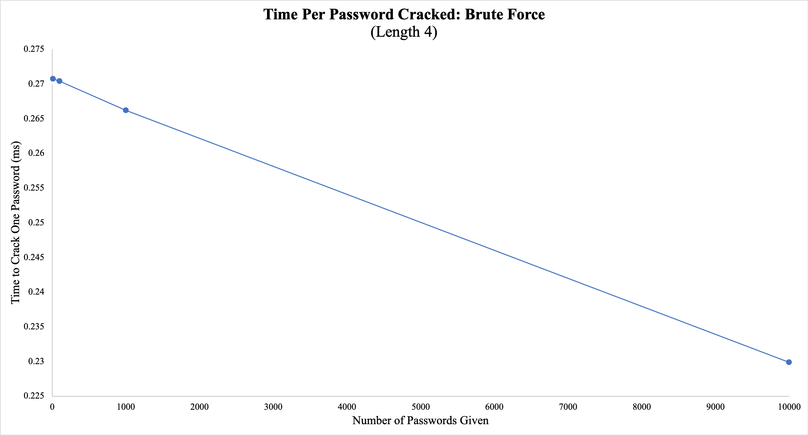
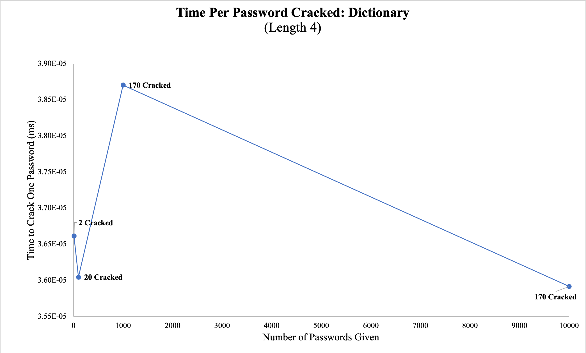
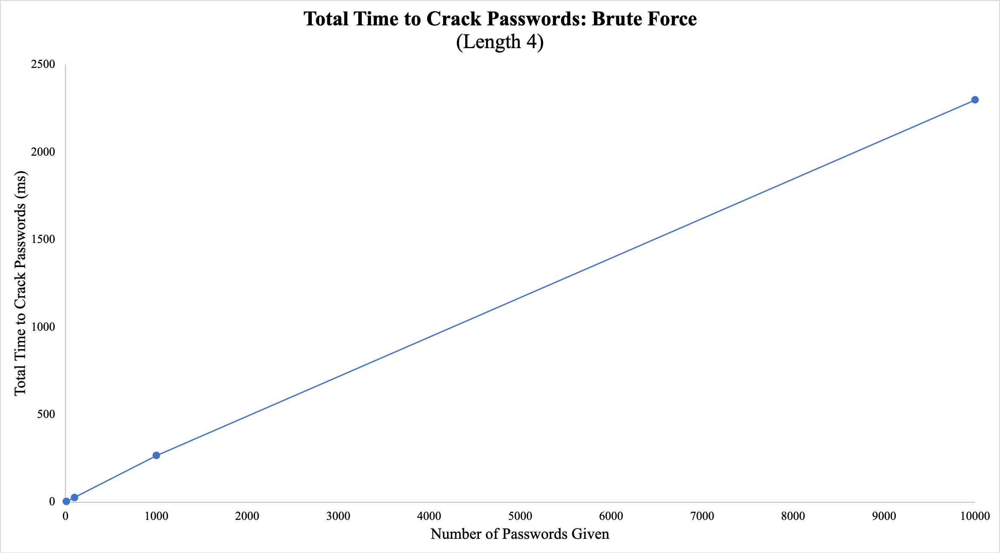
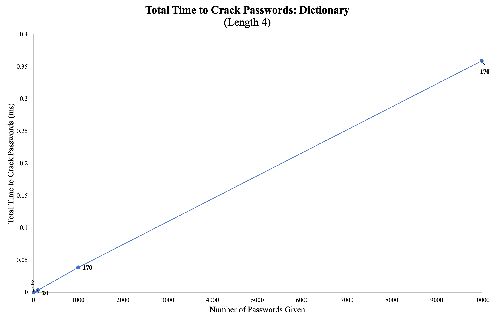

# CS240 Team Project: Password Cracking Algorithms
## Abigail McHugh, Amelia Chesebro, and Sophia Azaraev

**In 2019, over 160 million sensitive records were exposed as the result of data breaches (statistica.com). Password cracking is a common strategy for gaining access to user's information.
For our project, we compared two types of brute force attacks: a simple brute force attack, and a
dictionary attack.**

## _Generating fake data_
We created fake, random passwords of lowercase letters, passwordSize length in the `generateData()` function, which wrote passwords to the text file "passwords.txt": 

	void generateData(int data_size, std::vector<std::string> dictionary, int passwordSize){
	std::string str = "abcdefghijklmnopqrstuvwxyz";
	std::ofstream outputFile;
	outputFile.open("passwords.txt");
	for(int i = 0; i < data_size; ++i){
		std::string entry;
		int pos;
		int size = passwordSize + 1;
		while(entry.size() != size){
			pos = ((rand() % (str.size() - 1)));
			entry += str.substr(pos,1);
		}
		outputFile << entry << std::endl;

		if(i % 5 == 0 && i < dictionary.size()){
			outputFile << dictionary.at(i) << std::endl;
		}
	}
	outputFile.close();
	}

This function allowed us to control the number of passwords we wanted to crack as well as the length of each password. Additionally, we added a password from the most common 10,000 passwords, found online (see below for link) for every fifth entry. This allowed us to test out `dictionaryAttack()` function.

## _Simple brute force attack password cracker_
The `bruteForceAttack()` function shows our simple brute force algorithmn.

In main, we called `generateData()` with the number of passwords we wanted to generate. We then opened up the passwords.txt file written to by `generateData()`, and looped through each line in passwords.txt, calling `bruteForceAttack(permutation, startPosition, alphabet, guess, passwordSize)`, with alphabet being the letters used to make the permutations, the startPosition being set to 0, the password being read from passwords.txt, and the passwordSize specified in main.

The `bruteforceAttack()` function used a recursive call. If the position of the string = passwordSize, that meant a permutation of length passwordSize was created, and it compared the current password to this permtuation. If it was not, the start position was incremented and moved to the next letter of the alphabet. This way, it generated all permutations of the alphabet at length six, starting with a, b, c.. and moving through the rest of the alphabet.

	void bruteForceAttack(char *perm, int startPos, std::string alphabet, std::string password, int passwordSize){
	if(startPos == passwordSize) {
		std::string permString(perm);
		if(password.compare(permString)== 0)
			return;
	}
	else{
		for(int i=0; i<alphabet.length(); i++){
			perm[startPos]=alphabet[i];
			bruteForceAttack(perm, startPos+1, alphabet, password, passwordSize);
			}
		}	
	}

## _Dictionary attack password cracker_
The `dictionaryAttack()` method is simple. It looped through each line in the dictionary vector, and if the password matches dictionary.at(i), it returned true. If the password goes through the entire vector without a match, the function returned false.

	bool dictionaryAttack(std::vector<std::string>& dict, std::string& password){
		for(int i = 0; i < dict.size(); i++){
			if(dict.at(i).compare(password)==0){
				return true;
			}
		}
		return false;
	}

While the `bruteForceAttack()` function was void, `dictionaryAttack()` returns a bool. This is because `bruteForceAttack()` generates all permutations, so there is guarenteed to be a match. However, `dictionaryAttack()` only has finite set of guesses, which no guarentee that it will match our random strings created in `generateData()`. 

## _Main and program flow_
In main, we called `generateData()`, `bruteForceAttack()`, and `dictionaryAttack()`, to test the speed and effectiveness of simple brute force and dictionary password cracking algorithms:
- Read and validate-command line arguments.
- Loop through dictionary.txt file found online. Add passwords that meet criteria (i.e, are all letters and have passwordSize 	length).
- Call `generateData()` with passwordSize, dataSize, and the modified dictionary vector as arguments
- Start first clock using `std::chrono()`. Loop through each line in passwords.txt:
    - When `bruteForce()` cracks the password, return.
- Stop first clock.
- Output number of passwords cracked, total time to crack passwords, and average time per password for `bruteForceAttack()`.
- Start second clock using `std::chrono()`. Loop through each line in passwords.txt:
    - If `dictionaryAttack()` cracks the password, increment dictPasswordsCracked.
- Stop second clock.
- Output number of passwords cracked, total time to crack passwords, and average time per password for `dictionaryAttack()`.

## _Results_ 
- **Maximum number of operations for brute force** = (number of permutations) * (number of passwords)
- **Number of permutations** = 26!/(26-passwordLength)!
- **Number of permutations for password length 4**: 358,800
- **Number of permutations for password length 6**: 165,765,600
- **Maximum number of operations for dictionary** = (size of dictionary) * (number of passwords)

**_This graph shows how long the brute force attack took to crack one password when given 10, 100, 1000, and 10000 passwords all of length 4._**

**_This graph shows the same data except for a dictionary attack instead. This was also given 10, 100, 1000, 10000 passwords all of length 4. Each data point is labeled with how many passwords the algorithm was able to crack._**

**_This graph is the same brute force algorithm, but the time shown is the total amount of time it took for the given amount of passwords to be cracked. _**

**_This graph is the dictionary attack algorithm, the time shown is the total amount of time it took for the labeled amount of passwords to be cracked. _**

## _Conclusions_
The "better" algoritm depends on why it is being used. In our demo, we were concerned more with the success rate than the time. In real-world applications, however, hackers would be more inclined to use the dictionary method. Our passwords were randomly generated and so the dictionary attack was less likely to guess them. Real users, however, more often create predictable passwords than can be easily guessed by a dictionary, and would take a long time to crack via brute force. As shown above, the number of permutations for length 4 passwords, all lowercase letters was 358,800, while just going up to length 6 increased the number to 165,765,000. This number would increase even more if the passwords had uppercase letters, numbers, or symbols.

Ultimately, the "better" algorithm is determined by the developer's needs and the context of the problem. 

Link to dictionary used: https://github.com/danielmiessler/SecLists/blob/master/Passwords/Common-Credentials/10k-most-common.txt
